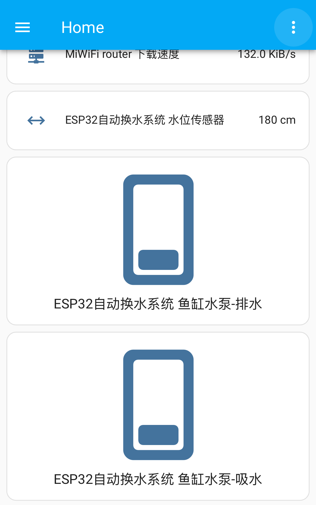

# 💧 水位控制 ESP32 Water Controller

一个基于 ESP32 + MQTT + Home Assistant 的智能鱼缸换水系统，可远程控制水泵排水/吸水，实时上报水位信息，并支持自动发现到 Home Assistant。

---

## ✨ 特性

- 🧠 自动注册到 Home Assistant（MQTT Discovery）
- 💬 支持双继电器控制（排水 / 吸水）
- 📡 实时水位传感器上报
- 🌐 配置集中管理：WiFi、MQTT 信息集中在 `Settings` 模块
- 🧩 模块化代码结构，易维护扩展

---

## 🔧 使用硬件

| 硬件             | 说明                            |
| ---------------- | ------------------------------- |
| ESP32 C3         | 主控板，支持多线程与 Wi-Fi 扩展  |
| 水位监测模块      | 监测水位（可不用）               |
| 自吸泵 ×2        | 吸水+排水                        |
| 继电器 x2        | 控制水泵开关                    |
| 杜邦线、电源模块 | 接线与供电                       |

---

## 📌 接线说明（示例）

| 功能                | 引脚                       |
| ------------------ | -------------------------- |
| 继电器-吸水自吸泵   | GPIO 27                    |
| 继电器-排水自吸泵   | GPIO 26                    |
| 水位传感器         | GPIO 32                     |

---

## 🚀 快速开始

1. 使用 VSCode + Arduino 插件
2. 按照接线图连接硬件
3. 搭建 MQTT 服务
4. 进入 Home Assistant，打开【设置】→【设备与服务】→【添加集成】→选择 MQTT，输入搭建的 MQTT 地址
5. 编译上传至 ESP32
6. 打开串口监视器，进入 HA 工作台查看新设备

---

## 📷 效果图



---

## 📁 项目结构

```bash
.
├── include/
│   ├── Settings.h          # 全局配置结构声明
│   ├── MqttHelper.h        # MQTT 模块头文件
│   ├── RelayControl.h      # 继电器控制模块头文件
│   ├── WiFiHelper.h        # WiFi 连接模块头文件
│   └── WaterSensor.h       # 水位传感器模块头文件
├── src/
│   ├── main.cpp            # 主程序
│   ├── Settings.cpp        # WiFi/MQTT 配置实现
│   ├── MqttHelper.cpp      # MQTT 通信逻辑
│   ├── RelayControl.cpp    # 水泵控制逻辑
│   ├── WiFiHelper.cpp      # WiFi 初始化与连接
│   └── WaterSensor.cpp     # 传感器数据读取与发布
├── .gitignore
├── platformio.ini          # VSCode/PlatformIO 项目配置
└── README.md

---

## 📜 License
本项目采用 [MIT License](./LICENSE) 许可证，欢迎自由使用、学习与改造。
